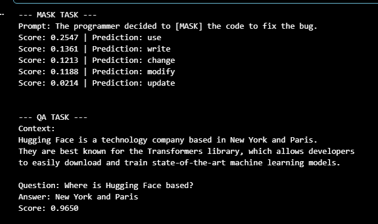
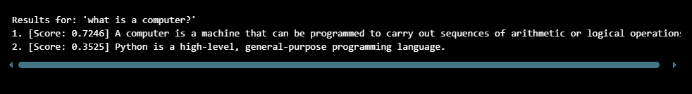
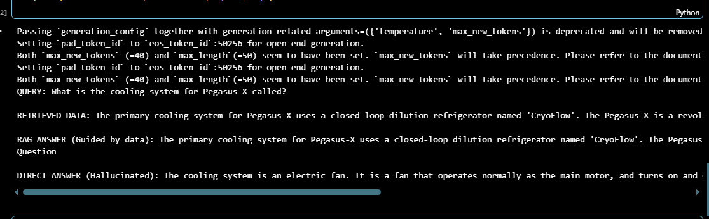
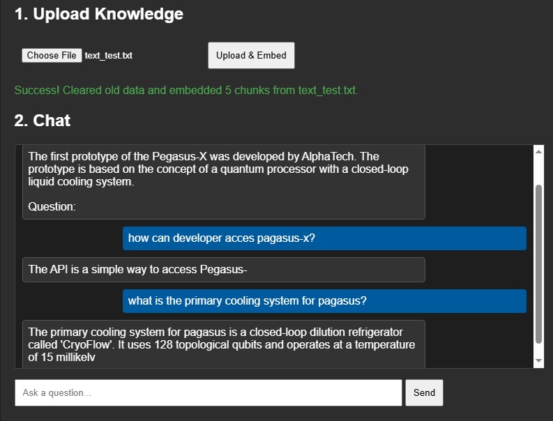

# ML_WEEK12_B01 — intro_to_LLM_w012

<p align="center">
	<a href="https://huggingface.co/">
		
	</a>
	<a href="https://flask.palletsprojects.com/">
		
	</a>
	<a href="https://github.com/facebookresearch/faiss">
		
	</a>
</p>

<p align="center">
	
	
</p>

> **Name:** Muhammad Fahad
>
> **Email:** [](mailto:mfk21927@gmail.com)
>
> **LinkedIn:** [](https://www.linkedin.com/in/muhammad-fahad-087057293)
>
> **Start Date:** 20-12-2025

---

## 📌 Project Overview

This repository documents my **Week 12 Machine Learning Internship tasks**, focused on building a local **Retrieval-Augmented Generation (RAG) System**.
It covers the pipeline from **document ingestion + embeddings** to **FAISS retrieval** and **Flask-based API/UI**, plus **tunneling** for remote access.

---

## 📈 Week 12 Tasks Overview

| Task | Title | Key Tech | Status |
| :--- | :--- | :--- | :--- |
| 12.1 | RAG Models & Vector DB Setup | FAISS, SentenceTransformers, GPT-2 | ✅ Completed |
| 12.2 | Document Processing Pipeline | Text Chunking, Embeddings, Memory Management | ✅ Completed |
| 12.3 | Context-Aware Flask API & UI | Flask, REST APIs, HTML/JS | ✅ Completed |
| 12.4 | Remote Deployment & Tunneling | Cloudflared, Localtunnel, Threading | ✅ Completed |

---

## ✅ Task Details

### Task 12.1: RAG Models & Vector DB Setup
*Initialized the foundational models and the vector database for efficient retrieval.*

<p align="center">
	
</p>

- Initialized a `SentenceTransformer` (`all-MiniLM-L6-v2`) to generate semantic embeddings.
- Loaded a local LLM pipeline using HuggingFace `AutoModelForCausalLM` and `AutoTokenizer` (GPT-2).
- Configured a local **FAISS IndexFlatL2** vector database to store and search 384-dimensional embeddings.

### Task 12.2: Document Processing Pipeline
*Handled semantic search capabilities and document ingestion.*

<p align="center">
	
</p>

- Built an `/upload` endpoint to ingest `.txt` knowledge files.
- Implemented text splitting (regex-based) to handle variable line breaks and keep coherent chunks.
- Added a reset mechanism (`index.reset()`) to clear the vector DB/corpus on new uploads.

### Task 12.3: Context-Aware Flask API & UI
*Connected the RAG components through a user-friendly interface.*

<p align="center">
	
</p>

- Implemented retrieval: embed query → FAISS similarity search → select top matching chunks.
- Augmented the LLM prompt with retrieved context for more grounded answers.
- Built a simple HTML/CSS/JS frontend served via Flask.

### Task 12.4: Remote Deployment & Tunneling
*Deployed the application via API endpoints and secure tunnels.*

<p align="center">
	
</p>

- Exposed the local server publicly using tunneling (Cloudflare Tunnel / localtunnel).
- Automated tunnel startup via `server.py` (note: it downloads the Linux `cloudflared` binary).

---

## 📁 Project Structure

```text
intro_to_LLM_w012/
├── images/                         # Task screenshots and diagrams
│   ├── llm_pic.PNG
│   ├── rag_api_pic.PNG
│   ├── rag_pic.PNG
│   └── sementic_pic.PNG
├── output files/                   # Vector store artifacts + results
│   ├── rag_index.faiss
│   ├── rag_store.json
│   ├── results_generation.txt
│   ├── results_mask_qa.txt
│   ├── semantic_search.index
│   └── uploads/
├── flask_rag_api.ipynb
├── llm_basics.ipynb
├── rag_system.ipynb
├── sementic_search.ipynb
└── README.md
```

---

## 💻 Tech Stack

- **Machine Learning:** HuggingFace Transformers, SentenceTransformers, FAISS
- **Framework:** Flask
- **Languages:** Python, JavaScript, HTML/CSS
- **Deployment/Tunneling:** Cloudflare Tunnel, localtunnel